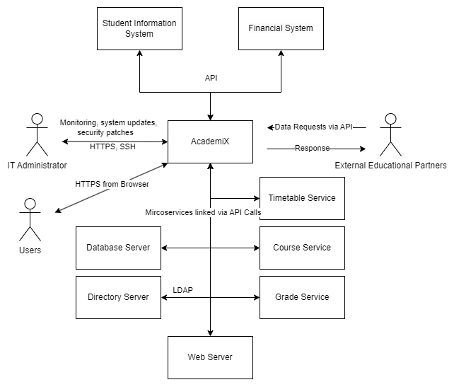
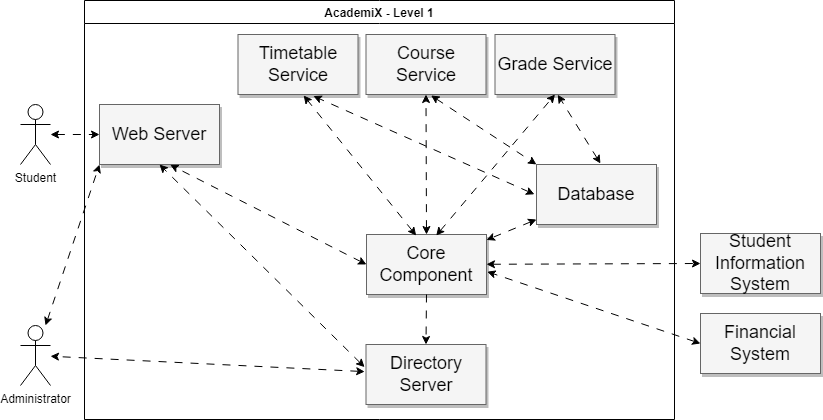
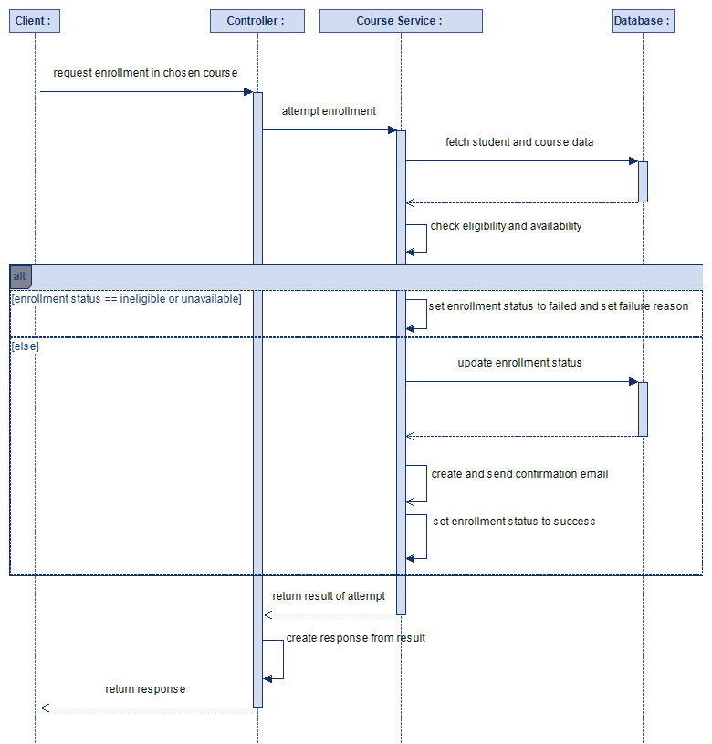
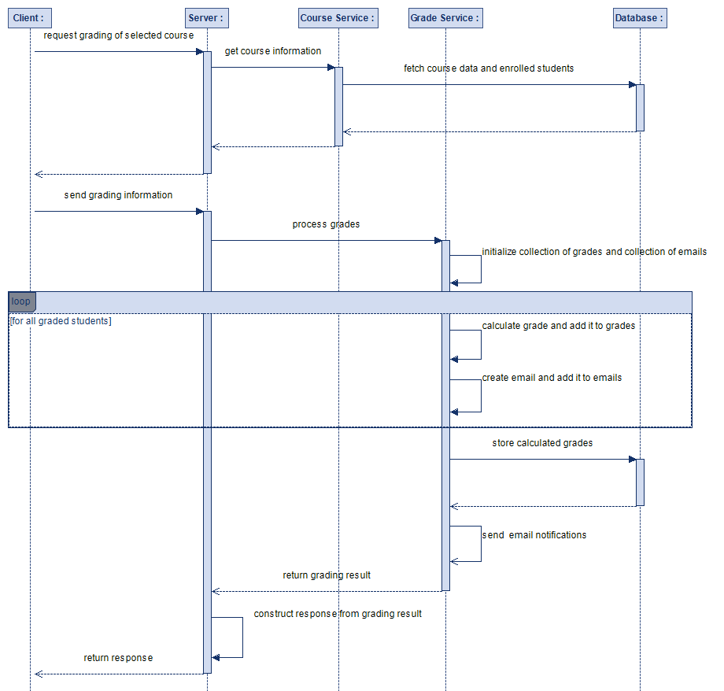
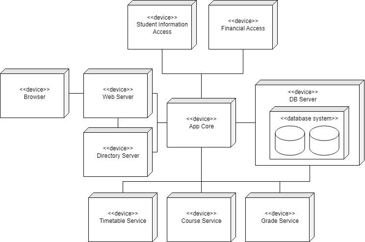
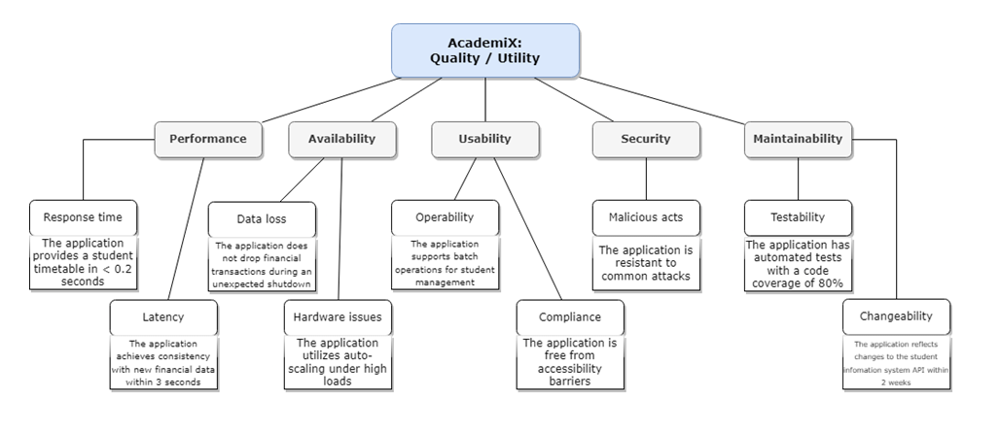

# 

**About arc42**

*TODO: change this generic header and add information about our scenario*

arc42, the template for documentation of software and system
architecture.

Template Version 8.2 EN. (based upon AsciiDoc version), January 2023

Created, maintained and © by Dr. Peter Hruschka, Dr. Gernot Starke and
contributors. See <https://arc42.org>.

This version of the template contains some help and explanations. It is
used for familiarization with arc42 and the understanding of the
concepts. For documentation of your own system you use better the
*plain* version.

# 1. Introduction and Goals

This document describes the university management application AcademiX.
It is used to provide students, faculty and staff with the ability to manage 
their academic, administrative, and financial activities.
The application will integrate with the university's existing student 
information system and financial management system.

## Requirements Overview

**Main features ([Business Requirements Document: Section 4. Features](../materials/university%20managment/brd.md))**
- User authentication and authorization
- Dashboard with relevant information and alerts
- Course and curriculum management
- Enrollment management
- Attendance tracking and reporting
- Grading and transcript management
- Billing and payment management
- Reporting and analytics

The application must handle approximately 35.000 total and approximately 
5.000 concurrent users. The system should be able to keep track of
5-10 courses per student in the span of one semester, storing all course 
information and attendance. Furthermore, the application should enable
users to make data-driven decision through reporting and analytics.

A [use case document](../materials/university%20managment/use%20case%20document.md)
can be found in the specification of the university management project.

## Quality Goals 

The top three quality goals for the architecture whose fulfillment is of 
the highest importance to the major stakeholders can be found in the following table. 
The quality characteristics are selected in accordance with the ISO 25010 standard.

| Priority | Quality           | Motivation                                                                    |
|----------|-------------------|-------------------------------------------------------------------------------|
| *1*      | *Reliability*     | *The current system is prone to human errors, and this should be improved*    |
| *2*      | *Usability*       | *The application should make processes more efficient and save time*          |
| *3*      | *Maintainability* | *Specific requirements are expected to change during the lifetime of the app* |

The complete overview of quality scenarios can be found in section [Quality Scenarios](#quality-scenarios).

## Stakeholders

The following table lists all important stakeholder and their expectations
from the AcademiX project.

| Name            | Role                        | Expectations                                                                                          |
|-----------------|-----------------------------|-------------------------------------------------------------------------------------------------------|
| *John Smith*    | *University Administrator*  | *Provide an efficient and user-friendly platform for managing academic and administrative activities* |
| *Jane Doe*      | *Senior Lecturer*           | *Efficient management (schedules, notifications, etc.), one application instead of multiple systems*  |
| *Michael Lee*   | *Chief Information Officer* | *Enable data-driven decision making through reporting and analytics*                                  |
| *Emily Chen*    | *Student Representative*    | *Enhance communication and collaboration among students*                                              |
| *Sarah Johnson* | *Financial Officer*         | *Streamline billing and payment processes and guarantee security*                                     |

The stakeholders have been taken from [Business Requirements Document: Section 6. Sign-off](../materials/university%20managment/brd.md)

# 2. Architecture Constraints

AcademiX shall be:
- platform-independent and should be accessible from all common web browsers (e.g. Chrome, Safari, Edge, Firefox and Samsung Internet), Android and iOS devices
- developed using modern web development technologies such as React, Node.js, and MongoDB
- hosted on a secure and scalable cloud infrastructure such as AWS or Azure
- integrated with the university's existing student information system and financial management system
- compiling with applicable data protection and privacy regulations
- verified by using automated tests
- operating within a predetermined monthly cloud budget
- presenting no barriers to people with physical disabilities

Taken from [Business Requirements Document: Section 5. Assumptions and Dependencies](../materials/university%20managment/brd.md)

# 3. System Scope and Context

The following diagram shows the business and technical context of the system.
More information can be found in the section [Context](#context).

## Context

In the following table users have been split up into students, 
faculty members and professors.

| Communication Partner         | Inputs                                                                          | Outputs                                                            | Interfaces                                 | Protocols/Formats |
|-------------------------------|---------------------------------------------------------------------------------|--------------------------------------------------------------------|--------------------------------------------|-------------------|
| Students                      | Course selections, personal data, assignment submissions, feedback and payments | Course materials, schedules, grades, billing information           | Browser, Web Server                        | HTTPS             |
| Professors                    | Course content, grades, attendance records and feedback                         | Schedule updates, administrative reports, student performance data | Faculty portal, academic databases         | HTTPS             |
| Faculty members               | Course information, financial data and timetable override information           | Enrollment reports, financial reports, timetable                   | Administrative dashboard                   | HTTPS             |
| IT Administrator              | System updates, security patches, user feedback                                 | System status reports, performance metrics                         | IT management tools                        | HTTPS, SSH        |
| External Educational Partners | Course data, enrollment information                                             | Joint program details, transfer credit information                 | Partner portals, data interchange services | HTTPS, API        |
| Student Information System    | Student personal information                                                    | Student personal information                                       | Standardised interface to parse data       | HTTPS, API        |
| Financial System              | Financial information                                                           | Financial information                                              | Standardised interface to parse data       | HTTPS, API        |
| Directory Server              | User data                                                                       | all object related data                                            | LDAP Interface for authentication          | LDAP              |
| Database Server               | Data, SQL Queries                                                               | requested data                                                     | JDBC (Java Database Connectivity)          | TCP/IP            |

# 4. Solution Strategy

| Goal/Requirements                                | Architectural Approach                       | Details                                                       |
|--------------------------------------------------|----------------------------------------------|---------------------------------------------------------------|
| *Authenticate and authorize users*               | *Dedicated server (LDAP)*                    | *[Technology Stack Selection](#technology-stack-selection)*   |
| *Course and curriculum management*               | *Multi-tier system (Clients, REST, API, DB)* | *[Runtime View](#6.-runtime-view)*                            |
| *Dashboard with relevant information and alerts* | *Web-app (React framework)*                  | *[Technology Stack Selection](#technology-stack-selection)*   |
| *Rapid scalability*                              | *Cloud Hosting (AWS)*                        | *[Cloud-Based Infrastructure](#cloud-based-infrastructure)*   |
| *Data security and integrity*                    | *Secure Communication Protocols (HTTPS)*     |                                                               |
| *Quality assurance*                              | *Automated Testing and CI/CD*                | *[Automated Testing and CI/CD](#automated-testing-and-ci-cd)* |

# 5. Building Block View

This overview visualizes the most important components and their dependencies of the application as black boxes:

**Motivation**  
The building block overview (level 1) is based on the decomposition of the application in self-contained subsystems that are each focused on specific business functionalities. Additionally, the relationships with users (students and administrators) and external systems (student information system and financial system) are represented.  

**Contained Building Blocks**  
This table describes the black boxes from level 1:

| **Name**              | **Responsibility**                                |
|-----------------------|---------------------------------------------------|
| **Web Server**        |  Handling client requests and delivering content. |
| **Core Component**    |  Connecting and coordinating services.            |
| **Timetable Service** |  Management of timetables.                        |
| **Course Service**    |  Management of courses.                           |
| **Grade Service**     |  Management of grades.                            |
| **Database**          |  Persistent storage of data.                      |
| **Directory Server**  |  Storing user information and validating actions. |     

**Important Interfaces**  
AcademiX depends on and integrates with two external systems: the student information system and the financial system. Interactions with these systems are described by and must follow the respective specification.    

# 6. Runtime View

This section describes concrete behavior and interactions of the
system’s building blocks in form of scenarios.

These scenarios are based on use cases described in the [Use Case Document](../materials/university%20managment/use%20case%20document.md). Refer to the linked document for additional scenarios and step-by-step descriptions.  

## Runtime Scenario 1: Student Enrollment

**Description**  
The student enrolls in a course through the university management application.

## Runtime Scenario 2: Course Grades Management

**Description**  
The faculty member manages course grades for a class through the university management application.

# 7. Deployment View

This section describes the technical infrastructure used to execute the system and the mapping of software components to those infrastructure elements.

**Infrastructure Level 1**  
This is a description of the top-level infrastructure in the system:

**Motivation**  
The diagram shows the different hardware devices that execute the distributed application. This overview represents the top-level infrastructure in the system and serves as a guide to all the system's part.  

**Quality and/or Performance Features**  
The entire system utilizes virtualized devices which is enabled by the AWS Infrastructure as a Service. 

**Mapping of Building Blocks to Infrastructure**  
The following table represents a mapping of the level 1 infrastructure units to software components:

| **Node**                   | **Artifact**                  | **Description**                                      |
|----------------------------|-------------------------------|------------------------------------------------------|
| Browser                    | None                          | Recent version of Chrome, Firefox, Safari, etc.      |
| Web Server                 | Nginx                         | Handles client requests and serves content           |
| Directory Server           | OpenLDAP                      | Stores user information and validates actions        |
| App Core                   | academix-core.jar             | Central application component                        |
| DB Server                  | MongoDB                       | Persistent NoSQL storage                             |
| Timetable Service          | academix-timetable.jar        | Microservice for timetable management                |
| Course Service             | academix-course.jar           | Microservice for course management                   |
| Grade Service              | academix-grade.jar            | Microservice for grade management                    |
| Student Information Access | Interface to external service | Transforms incoming/outgoing data to specific format |
| Financial Access           | Interface to external service | Transforms incoming/outgoing data to specific format |

# 8. Cross-cutting Concepts

The following section describes aspects of the application that affect multiple components and can, therefore, not be associated with individual modules.

**Concept 1: Logging**  
All components of the application must log events using the same pattern. The production environment is required to log at the level "INFO". These logs must be managed by a monitoring system and events with serious consequences must notify relevant staff members. 

**Concept 2: Synchronization**  
The application mediates between users (students and staff) and an external information source (the student information system).  
The database is required to be consistent with the information received by the student information system and changes to relevant information received from users (e.g.: personal information change by student) must be relayed to the external system.  

**Concept 3: Privacy and Compliance**  
The application must be compliant with relevant legal obligations, especially concerning privacy. This includes the General Data Protection Regulation as well as University bylaws.

# 9. Architecture Decisions

In the development of the University Management Application, several key architectural decisions have been made to ensure the project's success, scalability, and sustainability. These decisions are critical in shaping the overall architecture of the system and its ability to meet both current and future needs.

## Technology Stack Selection
- **Front-End Development**: React has been chosen for its component-based architecture, enhancing the responsiveness and scalability of the user interface.
- **Back-End Development**: Node.js is selected for its non-blocking I/O model, ensuring efficient handling of concurrent user requests.
- **Data Storage**: MongoDB, a NoSQL database, is chosen for its flexibility in handling diverse data types and scalability.
- **Authentication and Authorization**: LDAP is selected for its hierarchical structure, lightweight footprint and scalability.

## Cloud-Based Infrastructure
The application will be deployed on AWS, supporting scalability, high availability, and robust security features essential for protecting sensitive educational data.

## Microservices Architecture
Adopting a microservices architecture enhances scalability and maintainability. It allows individual modules like Student Management and Course Management to be developed, deployed, and scaled independently.

## API-First Approach
An API-first design facilitates integration with existing systems like the Student Information System and Financial Management System, ensuring seamless data exchange and integration with third-party services.

## Responsive Web Design
To accommodate the diverse range of devices used by students and faculty, the application is designed to be responsive across desktops, tablets, and mobile devices.

## Scalable Reporting and Analytics Module
The architecture includes a scalable solution for reporting and analytics, capable of handling large volumes of data and providing real-time insights.

## Automated Testing and CI CD
The project incorporates automated testing and CI/CD pipelines to maintain high code quality, streamline the development process, and reduce the risk of bugs or downtime.

# 10. Quality Requirements

## Quality Tree

The Quality Tree provides a visual representation of the quality goals for the AcademiX university management application. It outlines the primary quality attributes in a hierarchical structure, emphasizing the relationships and priorities among different quality goals. This approach helps the development team focus on critical quality aspects, aligning their work with the application's key objectives.

## Quality Scenarios

The Quality Scenarios section details specific conditions and situations to test the AcademiX application against its quality goals. These scenarios, simulating real-world challenges, define goals, stimuli sources, stimuli, environments, and desired responses. They are instrumental in evaluating the system's performance, security, usability, and reliability under various operational conditions.

| Goal                         | Source of Stimulus        | Stimulus                                | Environment                         | Response Measure                                                        |
|------------------------------|---------------------------|-----------------------------------------|-------------------------------------|-------------------------------------------------------------------------|
| Performance                  | Student                   | Checks timetable                        | Runtime under normal operation      | Timetable loads within 0.2s                                             |
| Functionality / Security     | Malicious Actor           | Database attack (SQL injection)         | Runtime under normal operation      | Request of malicious actor is denied, and event is reported             |
| Maintainability/Testability  | Developer                 | Developer tries to merge changes        | Design time                         | Code coverage is determined, and changes are rejected if coverage < 0.8 |
| Usability                    | Student                   | Navigation through application          | Runtime under normal operation      | 90% of users find the navigation intuitive in user surveys              |
| Scalability                  | System Admin              | Increased number of concurrent users    | Runtime under peak load             | System supports up to 10,000 concurrent users without degradation       |
| Reliability                  | Student                   | Accessing course material               | Runtime under normal operation      | 99.9% uptime guarantee for course material access                       |
| Accessibility                | Student with Disability   | Use of application                      | Runtime under normal operation      | Application is compliant with WCAG 2.1 Level AA standards               |
| Interoperability             | External System           | Exchange data with university system    | Runtime under normal operation      | Data exchange completes within 5 seconds 95% of the time                |
| Data Integrity               | Database Admin            | Database backup                         | Routine maintenance                 | Successful backup with 100% data integrity verified weekly              |
| Compliance                   | Auditor                   | Audit of user data handling             | During audit                        | Application demonstrates full compliance with GDPR and other laws       |
| Security / Privacy           | Student                   | Submission of sensitive data            | Runtime under normal operation      | All sensitive data is encrypted both in transit and at rest             |

# 11. Risks and Technical Debts

This section highlights potential risks and sources of technical debt in the development and operation of the AcademiX application. It identifies key components and dependencies at risk, providing a basis for proactive mitigation and planning. Early recognition and management of these elements are crucial for maintaining the application's long-term efficiency and adaptability.

| Component                   | Dependency                             | Description                                                                              | Technical Debt                                                                                                                                                                                                                                             |
|-----------------------------|----------------------------------------|------------------------------------------------------------------------------------------|------------------------------------------------------------------------------------------------------------------------------------------------------------------------------------------------------------------------------------------------------------|
| Front-End Framework         | React Library                          | The application's front end is developed using React.                                    | React's frequent updates may require regular refactoring of the codebase to stay up-to-date. This can lead to technical debt if not managed properly.                                                                                                      |
| Back-End Technology         | Node.js Runtime Environment            | Node.js is used for the backend services.                                                | Node.js, being single-threaded, might struggle under heavy computational tasks, leading to potential performance issues. Additionally, the asynchronous nature of Node.js can lead to callback hell if not handled with modern practices like async/await. |
| Database System             | MongoDB NoSQL Database                 | MongoDB is used as the primary database.                                                 | The NoSQL nature of MongoDB may lead to challenges in data consistency and integrity, especially in complex transaction scenarios. There might be a need for additional handling to ensure ACID properties.                                                |
| Microservices Architecture  | Microservices-based Architecture       | The application uses a microservices architecture for modular development.               | Microservices introduce complexity in terms of deployment, monitoring, and inter-service communication. This could lead to technical debt in managing a larger number of services and ensuring their seamless interaction.                                 |
| API Integration             | Third-party APIs                       | The application integrates with various third-party APIs for additional functionalities. | Third-party API changes or deprecations can lead to unexpected failures or the need for frequent updates, creating technical debt.                                                                                                                         |
| Responsive Design           | Responsive Web Design Technologies     | The application is designed to be responsive across various devices.                     | Continuous updates and testing across multiple devices and screen sizes can lead to technical debt, especially if new devices with different resolutions and aspect ratios are released.                                                                   |
| Scalability Concerns        | Scalable Cloud Infrastructure          | The application is expected to scale based on user demand.                               | Improper handling of scalability can lead to performance bottlenecks. Over-reliance on auto-scaling features can increase operational costs unexpectedly.                                                                                                  |
| Student Information System  | Existing University Information System | Our application will integrate with the existing information system.                     | The information system has security vulnerabilities and is not yet compliant with current privacy regulations.                                                                                                                                             |
| Financial Management System | Financial Management System API        | Our application will integrate with the existing financial management system.            | The financial management system offers an API, however, there is no current documentation available.                                                                                                                                                       |
| Cloud Deployment            | Amazon Web Services (AWS)              | Our application will be deployed on AWS.                                                 | This introduces vendor buy-in which could cause technical debt in the future.                                                                                                                                                                              |

# 12. Glossary

**Contents**

The glossary section includes key domain-specific and technical terms used in the context of the AcademiX university management application. This ensures a consistent understanding among stakeholders.

**Motivation**

Defining these terms is essential to maintain clarity and prevent misunderstandings due to the use of synonyms or homonyms, especially in a multi-language or diverse team environment.

| Term          | Definition                                                                                                                      |
|---------------|---------------------------------------------------------------------------------------------------------------------------------|
| AcademiX      | The university management application described in this document.                                                               |
| API           | Application Programming Interface - a set of protocols for building and interacting with software applications.                 |
| AWS           | Amazon Web Services - a cloud computing platform used for hosting AcademiX.                                                     |
| CI/CD         | Continuous Integration/Continuous Deployment - a method to frequently integrate and deploy code changes.                        |
| GDPR          | General Data Protection Regulation - EU legislation for data protection and privacy.                                            |
| LDAP          | Lightweight Directory Access Protocol - used for accessing and maintaining distributed directory information services.          |
| MongoDB       | A NoSQL database program, used as the primary database for AcademiX.                                                            |
| Node.js       | A JavaScript runtime environment that executes JavaScript code outside of a web browser.                                        |
| React         | A JavaScript library for building user interfaces, used for front-end development of AcademiX.                                  |
| SQL Injection | A code injection technique used to attack data-driven applications by inserting malicious SQL statements into a database query. |
| Usability     | The ease of use and learnability of a human-made object such as software or a tool.                                             |
| WCAG 2.1      | Web Content Accessibility Guidelines                                                                                            |